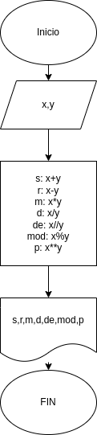

# Operaciones Aritmeticas
Programa para calcular la suma, resta, multiplicacion, division, division entera, modulo y potencia de 2 unidades

## Calcular mediante 2 numeros enteros distintas operaciones.

# Analisis

-Variable de entrada

X y Y: Es igual a dos numeros naturales, para desarrollar las operaciones aritmeticas correspondientes.

-Variable de salida

s: x+y
r: x-y
m: x*y
d: x/y
de: x//y
mod: x%y
p: x**y

# Diseño
 

# Contruccion

ejercicio N.3 Implementar programa para operaciones aritmeticas.

s: x+y
r: x-y
m: x*y
d: x/y
de: x//yf
mod: x%y
p: x**y

## ESTE PROGRAMA ESTA ESCRITO EN LENGUAJE MARKDOWN